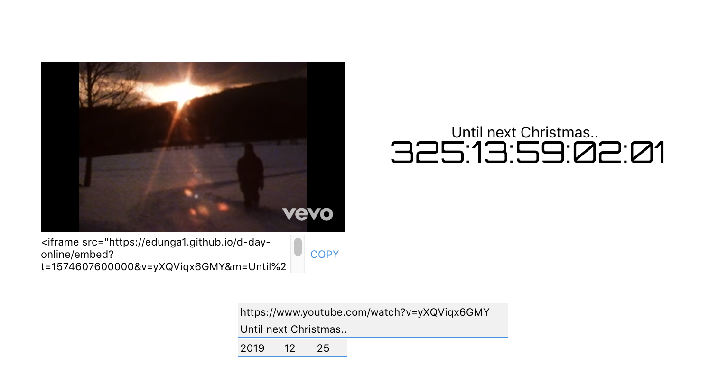
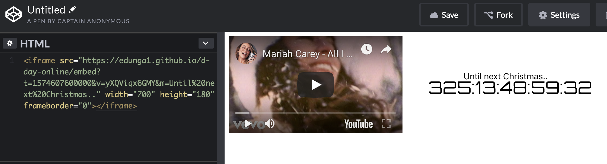

# Introduction

iframe-based, d-day timer.

[https://github.com/Edunga1/d-day-online](https://github.com/Edunga1/d-day-online)

You can adjust the youtube link and date on the main page. like below:

Then copy the iframe tag and share!

 
[https://codepen.io/anon/pen/gZoqGR](https://codepen.io/anon/pen/gZoqGR)
